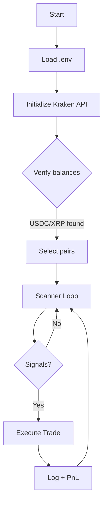
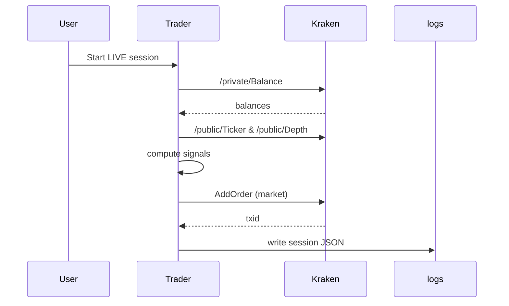

# Trading Engine Clean

A professional, senior-engineered Kraken CEX microstructure trading system. This repo includes live trading bots, risk management agents, and tooling to operate a lean, auditable trading workflow.

## Table of Contents
- Overview
- Features
- Architecture
- Flow Maps & Diagrams
- Getting Started
- Configuration
- Run Guides
- Logs & Telemetry
- Security & Safety
- License

## Overview
This system focuses on Kraken exchange live trading, with microstructure signals:
- Premium gap vs Binance US
- Spread compression detection
- Order book imbalance
- Adaptive momentum

## Features
- Kraken-only live trading bot with balance verification
- Agents for scanning, risk, execution, supervision
- Config-driven via `.env` and `config/` files
- Logging to `logs/` and state in `state/`

## Architecture


### Components
- `kraken_live_trader_v2.py`: Kraken microstructure bot
- `agents/`: Strategy and supervisory agents
- `config/`: JSON/YAML configuration files
- `logs/`: Session logs

## Flow Maps & Diagrams


## Getting Started
- Python 3.10+
- Create `.venv` and install `requirements.txt`
- Populate `.env` with `KRAKEN_API_KEY/SECRET`

## Configuration
Key `.env` entries:
- `KRAKEN_API_KEY`, `KRAKEN_API_SECRET`
- `KRAKEN_ENABLED_PAIRS=XRP`
- `KRAKEN_TRADE_BUFFER=1.08`

## Run Guides
- Paper mode:
  ```
  .\.venv\Scripts\python.exe .\kraken_live_trader_v2.py 300
  ```
- Live mode:
  ```
  .\.venv\Scripts\python.exe .\kraken_live_trader_v2.py 1800 --live
  ```

## Logs & Telemetry
- `logs/session_*.json` contains session summary
- Console shows scans, signals, executions

## Security & Safety
- Keys are loaded from `.env`
- Avoid committing secrets; `.gitignore` excludes sensitive files

## License
See `LICENSE`.
