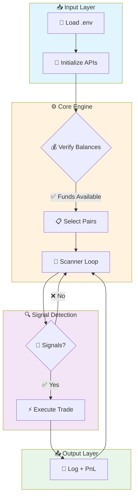
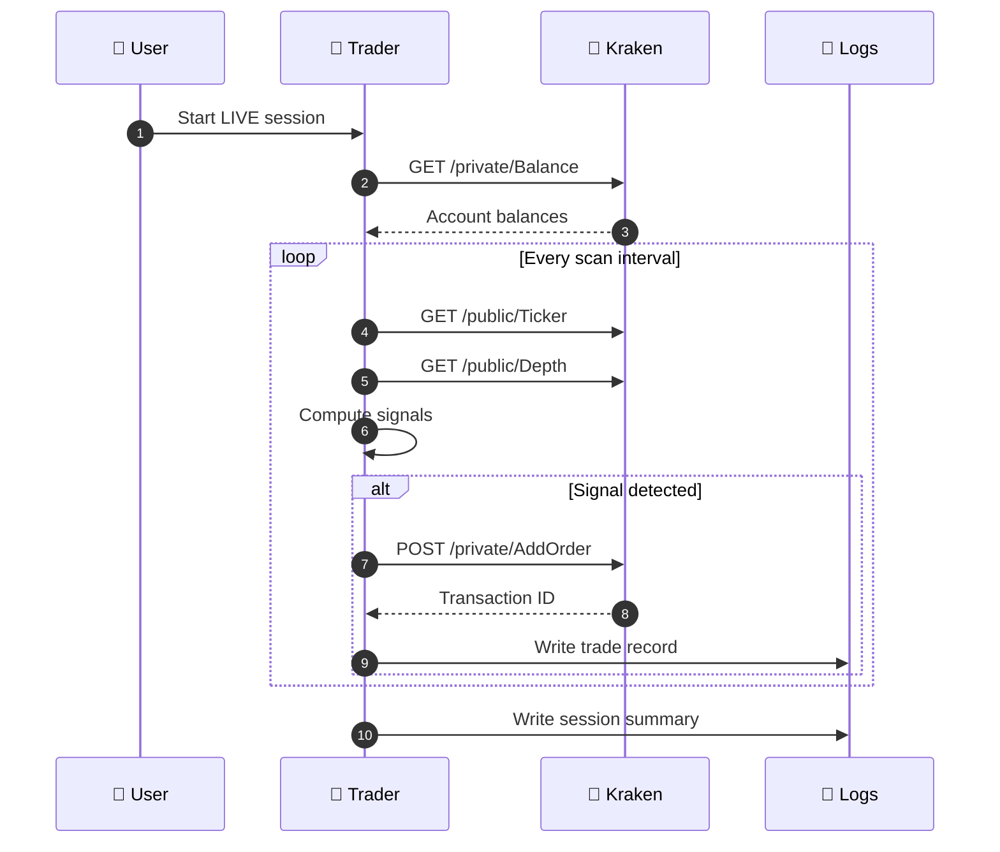

<div align="center">

# 🐉 Trading Engine

[](https://github.com/kevanbtc/trader1-/actions/workflows/ci.yml)
[](https://kevanbtc.github.io/trader1-/)
[](https://www.python.org/)
[](LICENSE)

**A professional, senior-engineered multi-exchange microstructure trading system**

*Live trading bots • Risk management agents • DeFi arbitrage • AWS deployment ready*

---

[🎯 Overview](#-overview) •
[🚀 Quick Start](#-quick-start) •
[⚙️ Configuration](#%EF%B8%8F-configuration) •
[📊 Architecture](#-architecture--components)

</div>

---

## 📑 Table of Contents

| Section | Description |
|---------|-------------|
| [🎯 Overview](#-overview) | System capabilities and trading signals |
| [🚀 Quick Start](#-quick-start) | Get up and running in minutes |
| [✨ Features](#-features) | Complete feature list |
| [📊 Architecture](#-architecture--components) | System design and components |
| [🔄 Flow Diagrams](#-flow-diagrams) | Visual execution flows |
| [⚙️ Configuration](#%EF%B8%8F-configuration) | Environment and config files |
| [🏃 Run Guides](#-run-guides) | Paper and live trading modes |
| [🔥 APEX Mode](#-apex-mode) | Advanced multi-module trading |
| [☁️ AWS Deployment](#%EF%B8%8F-aws-deployment) | Cloud deployment guide |
| [📈 Monitoring](#-monitoring--telemetry) | Logs and live visualization |
| [🔧 CI/CD](#-cicd--docs-site) | Automation and documentation |
| [🛡️ Safety](#%EF%B8%8F-safety-limits-and-minimums) | Risk management and limits |
| [📄 License](#-license) | MIT License |

---

## 🎯 Overview

This system provides **professional-grade cryptocurrency trading** with support for:

| Exchange | Type | Status |
|----------|------|--------|
| 🦑 **Kraken** | CEX | ✅ Production Ready |
| 🦄 **Uniswap V3** | DEX | ✅ Production Ready |
| 🍣 **SushiSwap** | DEX | ✅ Production Ready |
| 🐪 **Camelot** | DEX | ✅ Production Ready |
| 🌊 **Curve** | DEX | ✅ Production Ready |
| 📊 **GMX** | DEX | ✅ Production Ready |

### 📡 Trading Signals

| Signal Type | Description | Use Case |
|------------|-------------|----------|
| 💹 **Premium Gap** | Price differential vs Binance US | Cross-exchange arbitrage |
| 📉 **Spread Compression** | Tightening bid-ask detection | Pre-bounce signals |
| ⚖️ **Order Book Imbalance** | Buy/sell pressure analysis | Momentum prediction |
| 🎯 **Adaptive Momentum** | Dynamic window calculations | Trend following |

---

## 🚀 Quick Start

### Prerequisites

```bash
# Required
Python 3.10+
Git
```

### Installation

```bash
# 1. Clone the repository
git clone https://github.com/kevanbtc/trader1-.git
cd trader1-

# 2. Create virtual environment
python -m venv .venv

# 3. Activate environment
# Windows:
.\.venv\Scripts\activate
# Linux/Mac:
source .venv/bin/activate

# 4. Install dependencies
pip install -r requirements.txt

# 5. Configure environment
cp config/.env.template .env
# Edit .env with your API keys
```

### First Run

```bash
# Paper trading (simulation) - 5 minutes
python kraken_live_trader_v2.py 300

# Live trading - 30 minutes
python kraken_live_trader_v2.py 1800 --live
```

---

## ✨ Features

<table>
<tr>
<td width="50%">

### 🏦 Exchange Integration
- ✅ Kraken live trading with account verification
- ✅ Accurate pair mapping (BTC→XBT)
- ✅ Holdings-aware order filtering
- ✅ Minimum order enforcement

</td>
<td width="50%">

### 🔍 Signal Detection
- ✅ Premium gap detection
- ✅ Spread compression analysis
- ✅ Adaptive momentum windows
- ✅ Order book imbalance signals

</td>
</tr>
<tr>
<td width="50%">

### 🛡️ Risk Management
- ✅ Position sizing limits
- ✅ Capital-aware BUY filtering
- ✅ Holdings-aware SELL filtering
- ✅ Profit threshold validation

</td>
<td width="50%">

### 📊 Infrastructure
- ✅ MkDocs documentation site
- ✅ GitHub Actions CI/CD
- ✅ Session logging & telemetry
- ✅ Live trading viewers

</td>
</tr>
</table>

---

## 📊 Architecture & Components



### 📁 Project Structure

```
trader1-/
├── 🐍 kraken_live_trader_v2.py   # Main Kraken trading bot
├── 🚀 start_trading.py           # DeFi trading launcher
├── 📊 apex_dashboard.py          # APEX mode dashboard
├── 🤖 agents/                    # Strategy & execution agents
│   ├── apex_coordinator.py       # Multi-module orchestrator
│   ├── defi_price_feed.py        # DEX price aggregation
│   ├── risk_manager.py           # Position & risk control
│   └── ...                       # 50+ specialized agents
├── ⚙️ config/                    # Configuration files
│   ├── .env.template             # Environment template
│   ├── trading_config.json       # Trading parameters
│   └── token_universe.json       # Token definitions
├── 📚 docs/                      # MkDocs documentation
├── 🔧 tools/                     # Utility tools
└── ☁️ aws-deploy/                # AWS deployment configs
```

### 🤖 Agent System

| Agent | Purpose | Status |
|-------|---------|--------|
| `agent1_premium_tracker` | Cross-exchange price monitoring | 🟢 Active |
| `agent2_spread_compression` | Bid-ask spread analysis | 🟢 Active |
| `agent3_iceberg_sniper` | Large hidden order detection | 🟢 Active |
| `agent4_tri_loop` | Triangular arbitrage | 🟢 Active |
| `agent5_maker_rebate` | Maker fee optimization | 🟢 Active |
| `apex_coordinator` | Multi-module orchestration | 🟢 Active |
| `risk_manager` | Position sizing & limits | 🟢 Active |
| `flashloan_executor` | Capital-free execution | 🟡 Beta |

---

## 🔄 Flow Diagrams

### Trade Execution Sequence



---

## ⚙️ Configuration

### Environment Variables

Create a `.env` file in the project root:

```env
# ═══════════════════════════════════════════════════════════════
# 🔐 API CREDENTIALS
# ═══════════════════════════════════════════════════════════════
KRAKEN_API_KEY=your_kraken_api_key
KRAKEN_API_SECRET=your_kraken_api_secret

# ═══════════════════════════════════════════════════════════════
# 📊 TRADING PARAMETERS
# ═══════════════════════════════════════════════════════════════
KRAKEN_ENABLED_PAIRS=XRP,ETH,BTC
KRAKEN_TRADE_BUFFER=1.08

# ═══════════════════════════════════════════════════════════════
# 💰 POSITION LIMITS
# ═══════════════════════════════════════════════════════════════
MIN_PROFIT_USD=0.03
MIN_POSITION_USD=5
MAX_POSITION_USD=100

# ═══════════════════════════════════════════════════════════════
# 🌐 RPC ENDPOINTS (DeFi)
# ═══════════════════════════════════════════════════════════════
ARB_RPC_1=https://arb1.arbitrum.io/rpc
ARB_RPC_2=https://arbitrum.llamarpc.com
ARB_RPC_3=https://rpc.ankr.com/arbitrum
```

### Configuration Files

| File | Purpose |
|------|---------|
| `config/trading_config.json` | Core trading parameters |
| `config/token_universe.json` | Token definitions (40+ tokens) |
| `config/regimes.json` | Market regime definitions |
| `config/bots.json` | Bot configurations |

---

## 🏃 Run Guides

### 📝 Paper Trading (Simulation)

```bash
# Short test - 5 minutes
python kraken_live_trader_v2.py 300

# Extended test - 1 hour
python kraken_live_trader_v2.py 3600
```

### 💰 Live Trading

```bash
# Kraken CEX - 30 minutes
python kraken_live_trader_v2.py 1800 --live

# DeFi arbitrage
python start_trading.py --duration 3600
```

### 🔥 APEX Mode

```bash
# Demo mode (safe testing)
python demo_apex.py

# Full APEX with all modules
python start_trading.py --apex --duration 3600
```

---

## 🔥 APEX Mode

**APEX Mode** transforms the trading engine into a professional-grade alpha extraction system with 5 advanced modules:

| Module | Description | Benefit |
|--------|-------------|---------|
| 🌐 **Token Universe** | 40+ tokens across 8 categories | 5-10x more opportunities |
| 🔄 **Multi-Hop Router** | Graph-based triangular arbitrage | Exponential opportunity space |
| ⚡ **Flashloan Executor** | 10-100x position scaling | Zero capital requirement |
| 🎯 **Block Event Hunter** | Real-time whale/oracle monitoring | Alpha from information asymmetry |
| 🔮 **Predictive Liquidity** | Order book depth analysis | Catch micro-arbs early |

### Performance Comparison

| Mode | Opportunities/Hour | Avg Profit | Source |
|------|-------------------|------------|--------|
| 📊 Standard | 0-2 | $0.10 | 2-hop same-DEX |
| 🦁 Predator | 2-5 | $0.08 | 9 DEXes, 20 tokens |
| 🔥 **APEX** | 10-30 | $0.15 | Multi-hop + events + prediction |

> 📚 See [`APEX_MODE.md`](APEX_MODE.md) for complete documentation.

---

## ☁️ AWS Deployment

The system is **AWS-ready** with included deployment configurations:

```
aws-deploy/
├── supervisor-apex.conf    # Process management
├── deploy.sh               # Deployment script
└── requirements.txt        # AWS dependencies
```

### Architecture on AWS

```
┌─────────────────────────────────────────────────┐
│        AWS EC2 Instance (c5.xlarge)             │
├─────────────────────────────────────────────────┤
│  ┌─────────────┐  ┌─────────────┐              │
│  │ RPC Mirror  │  │   Mempool   │              │
│  │ (Port 8547) │  │   Sniffer   │              │
│  └──────┬──────┘  └─────────────┘              │
│         │                                       │
│  ┌──────▼───────────────────────────────────┐  │
│  │     Trading Engine (start_trading.py)    │  │
│  │  • Scans 4x per second                   │  │
│  │  • Multi-DEX arbitrage detection         │  │
│  │  • Automatic trade execution             │  │
│  └──────────────────────────────────────────┘  │
└─────────────────────────────────────────────────┘
```

> 📚 See [`WHAT_IS_YOUR_AWS_SETUP.md`](WHAT_IS_YOUR_AWS_SETUP.md) for complete deployment guide.

---

## 📈 Monitoring & Telemetry

### Log Files

| File Pattern | Content |
|--------------|---------|
| `logs/session_*.json` | Session summaries with PnL |
| `logs/error_*.log` | Error logs |
| `logs/opportunity_ledger.log` | All detected opportunities |

### Live Monitoring Tools

```bash
# Watch opportunity ledger in real-time
python watch_ledger.py

# Live trading visualization
python live_trading_viewer.py

# AWS mission control dashboard
python aws_mission_control.py
```

---

## 🔧 CI/CD & Docs Site

### GitHub Actions Workflows

| Workflow | Trigger | Actions |
|----------|---------|---------|
| `ci.yml` | Push/PR to main | Lint + syntax check |
| `pages.yml` | Push to main | Build & deploy docs |

### Documentation Site

The project includes an **MkDocs Material** documentation site:

```bash
# Local preview
pip install mkdocs mkdocs-material
mkdocs serve

# Build static site
mkdocs build
```

📚 **Live docs:** [kevanbtc.github.io/trader1-](https://kevanbtc.github.io/trader1-/)

---

## 🛡️ Safety, Limits, and Minimums

<table>
<tr>
<td>

### ⚠️ Risk Controls

- ✅ Respect Kraken minimum order sizes
- ✅ BUYs filtered if capital below minimum
- ✅ SELLs only for held assets
- ✅ Balance verification before trading

</td>
<td>

### 💡 Best Practices

- Start with paper trading
- Use conservative profit thresholds
- Monitor gas costs on DeFi
- Review session logs regularly

</td>
</tr>
</table>

> ⚠️ **Disclaimer:** Trading cryptocurrency involves significant risk. Always test thoroughly in paper mode before live trading. Past performance does not guarantee future results.

---

## 📄 License

This project is licensed under the **MIT License** - see the [LICENSE](LICENSE) file for details.

```
MIT License
Copyright (c) 2025 Kevan
```

---

<div align="center">

**Built with ❤️ for the trading community**

[](https://github.com/kevanbtc/trader1-/stargazers)
[](https://github.com/kevanbtc/trader1-/network/members)

</div>
