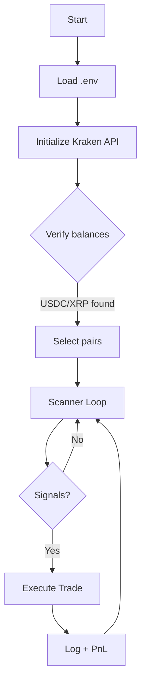
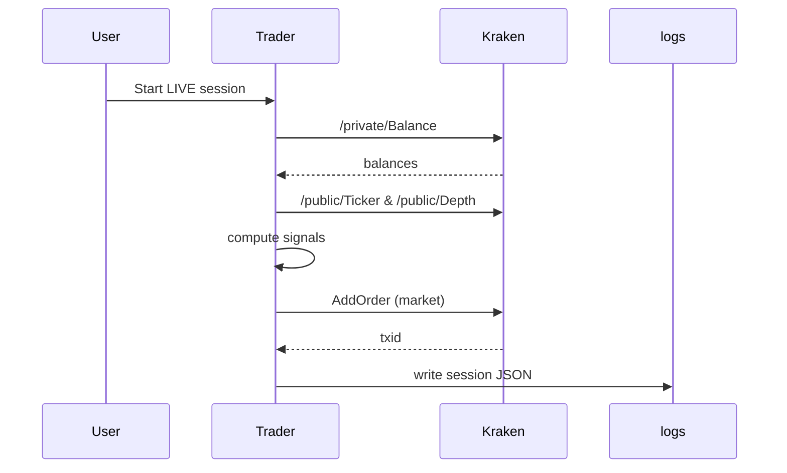

# Trading Engine Clean


A professional, senior-engineered Kraken CEX microstructure trading system. This repo includes live trading bots, risk management agents, and tooling to operate a lean, auditable trading workflow.

## Table of Contents
- Overview
- Quick Start
- Features built so far
- Architecture & Components
- Flow Maps & Diagrams
- Runtime Modes
- Configuration (.env and JSON/YAML)
- Run Guides
- Logging & Telemetry
- CI/CD & Docs Site
- Safety, Limits, and Minimums
- License
- CI Status

## Overview
This system focuses on Kraken exchange live trading, with microstructure signals:
- Premium gap vs Binance US
- Spread compression detection
- Order book imbalance
- Adaptive momentum

## Quick Start
- Python 3.10+
- Create `.venv` and install `requirements.txt`
- Populate `.env` with `KRAKEN_API_KEY/SECRET`
- Start a short live verification:
  ```
  .\.venv\Scripts\python.exe .\kraken_live_trader_v2.py 1800 --live
  ```

## Features built so far
- Kraken-only live trading bot with correct account verification banner (private `/Balance`)
- Accurate Kraken pair mapping (BTC→XBT, etc.) and enabled pairs via `.env`
- Opportunity scanner: premium gap, spread compression, adaptive momentum, orderbook imbalance
- Holdings-aware filters (BUYs respect minimums/capital; SELLs only if held)
- Minimum order enforcement aligned with Kraken constraints
- Robust `.env` loading and runtime parameterization
- MkDocs docs site (Material theme) with architecture/flow diagrams
- CI: Lint + Python syntax checks
- Docs auto-publish via GitHub Pages (workflow added)
- Logs: session summaries, errors, and an opportunity ledger; live viewers included

## Architecture & Components


### Components
- `kraken_live_trader_v2.py`: Kraken microstructure bot
- `agents/`: Strategy and supervisory agents
- `config/`: JSON/YAML configuration files
- `logs/`: Session logs

### Runtime Modes
- Paper (simulation): no real orders; logs opportunities
- Live: authenticates to Kraken, executes orders within minimums and risk filters

## Flow Maps & Diagrams


## Configuration (.env and JSON/YAML)
Key `.env` entries:
- `KRAKEN_API_KEY`, `KRAKEN_API_SECRET`
- `KRAKEN_ENABLED_PAIRS=XRP`
- `KRAKEN_TRADE_BUFFER=1.08`
Optional training signals:
- `MIN_PROFIT_USD`, `MIN_POSITION_USD`, `MAX_POSITION_USD`

## Run Guides
- Paper mode:
  ```
  .\.venv\Scripts\python.exe .\kraken_live_trader_v2.py 300
  ```
- Live mode:
  ```
  .\.venv\Scripts\python.exe .\kraken_live_trader_v2.py 1800 --live
  ```

## Logging & Telemetry
- `logs/session_*.json` contains session summary
- `logs/error_*.log` contains recent errors if any
- `watch_ledger.py` and `live_trading_viewer.py` provide live visualization

## CI/CD & Docs Site
- GitHub Actions CI (`.github/workflows/ci.yml`) runs lint and Python syntax checks.
- GitHub Pages deploy (`.github/workflows/pages.yml`) builds MkDocs and publishes the site.
- `mkdocs.yml` at repo root configures the docs site; content in `docs/` folder.

## Safety, Limits, and Minimums
- Respect Kraken minimum order sizes (BUYs filtered if capital below minimum).
- SELLs only for held assets; balance banner confirms holdings.
- Use training thresholds cautiously; small profits may be negative after fees.

## CI Status
GitHub Actions CI runs lint and a syntax check on every push/PR to `main`.
Badge at top reflects current status.

## License
See `LICENSE`.
