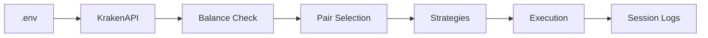
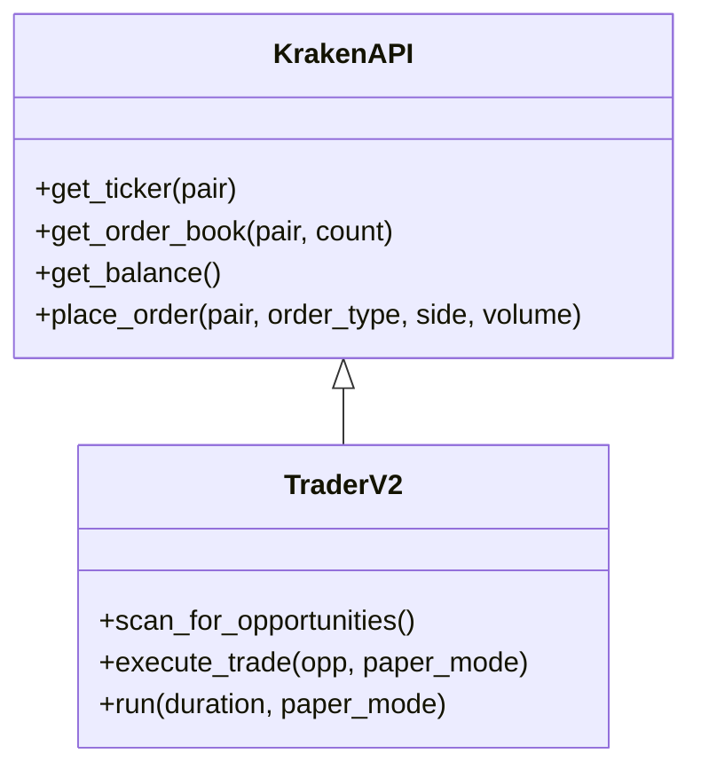

# Architecture

This document provides a deeper look into the trading engine architecture.

## Table of Contents
- System Overview
- Diagrams
- Components
- Data Flow
- Runtime Behavior

## System Overview
- Kraken API client with persistent nonce
- Signal detectors: premium gap, spread compression, momentum, order book imbalance
- Execution engine honoring Kraken minimums and live balances
- Logging for sessions and PnL

## Diagrams

## Components
- `KrakenAPI`: thin client for private/public endpoints, with nonce management
- `TraderV2`: orchestrates scanning, filtering, and execution
- `agents/`: modular strategies, risk guards, and supervisors
- `config/`: declarative behavior for bots/regimes

## Data Flow
1. Load `.env` → API keys, pairs, thresholds
2. Verify balances (`/private/Balance`) → account banner
3. Fetch market data (`/public/Ticker`, `/public/Depth`)
4. Compute signals → assemble opportunities
5. Risk filters + minimums → executable set
6. Place order (live) or log (paper) → write session

## Runtime Behavior
- Paper mode: scans continuously, logs opportunities and simulated outcomes
- Live mode: executes orders that pass filters, writes trade log and session PnL
