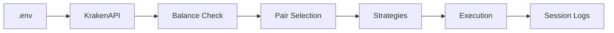
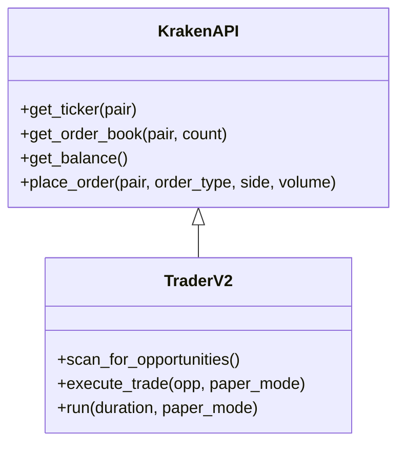

# Architecture

This document provides a deeper look into the trading engine architecture.

## System Overview
- Kraken API client with persistent nonce
- Signal detectors: premium gap, spread compression, momentum, order book imbalance
- Execution engine honoring Kraken minimums and live balances
- Logging for sessions and PnL

## Diagrams

