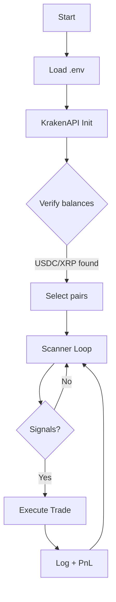
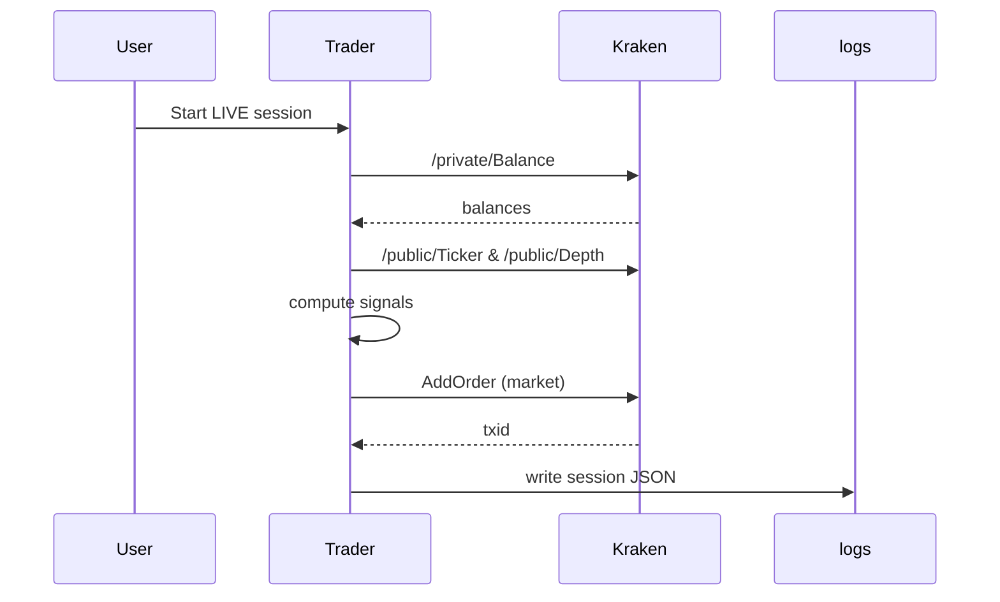

# Flow Maps

This page illustrates the end-to-end runtime with simplified flow and sequence diagrams.

## Table of Contents
- High-level flowchart
- Sequence of a live trade
- Notes on signals and filters

## Notes on signals and filters
- Signals include premium gap, spread compression, momentum, and order book imbalance.
- Filters apply Kraken minimums, holdings-awareness, and configured profit/position thresholds.
- Execution only occurs when an opportunity passes all filters in live mode.
