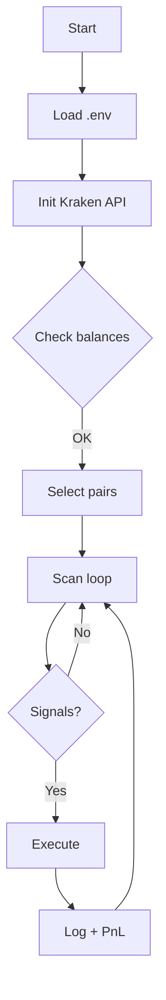
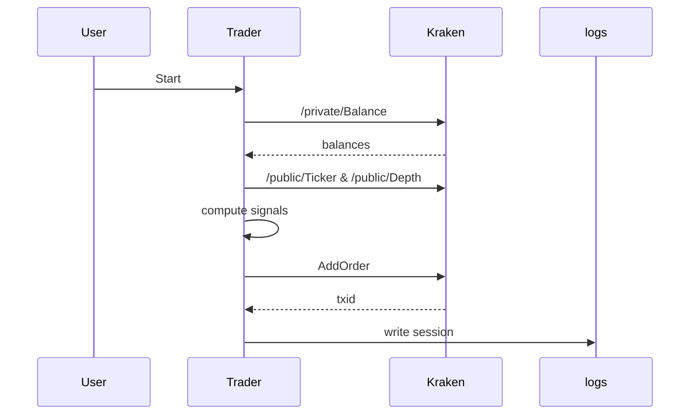

# Trader1 Kraken Trading

This documentation covers the Kraken-first microstructure trading engine, its architecture, components, runtime modes, and operating procedures.

## Table of Contents

- Highlights
- Quick Start
- What’s built
- Architecture overview
- Flow maps
- Runtime modes
- Configuration
- Logging & telemetry
- CI/CD & docs
- Safety & minimums

## Highlights
- Kraken-only live trading
- Real-time signal detection (premium gap, spread compression, order book imbalance, momentum)
- Safe execution honoring Kraken minimums and live balances
- CI for lint and syntax checks; auto-publish docs site

## Quick Start
1. Create a Python virtual environment
2. Install dependencies from `requirements.txt`
3. Populate `.env` with `KRAKEN_API_KEY` and `KRAKEN_API_SECRET`
4. Run in paper or live mode

```powershell
# Paper mode
.\.venv\Scripts\python.exe .\kraken_live_trader_v2.py 300

# Live mode (verifies balances at startup)
.\.venv\Scripts\python.exe .\kraken_live_trader_v2.py 1800 --live
```

## What’s built
- Balance verification banner from `/private/Balance`
- Accurate Kraken pair mapping and enabled-pairs via `.env`
- Opportunity scanner across multiple microstructure signals
- Holdings-aware filters and minimum order enforcement
- MkDocs site and GitHub Pages deployment

## Architecture overview


## Flow maps


## Runtime modes
- Paper (no orders): simulate signals and log opportunities
- Live: authenticate, execute orders that pass risk filters and minimums

## Configuration
- `.env`: API keys, enabled pairs, buffers, risk thresholds
- `config/`: JSON/YAML for bots and regimes

## Logging & telemetry
- `logs/session_*.json` summary
- `logs/error_*.log` recent errors
- `watch_ledger.py`, `live_trading_viewer.py` for visualization

## CI/CD & docs
- CI workflow runs lint + syntax check on push/PR
- Docs workflow builds and publishes MkDocs site via GitHub Pages

## Safety & minimums
- Honor Kraken minimums; filter BUYs if capital below threshold
- SELLs only if asset held; balances verified at startup
